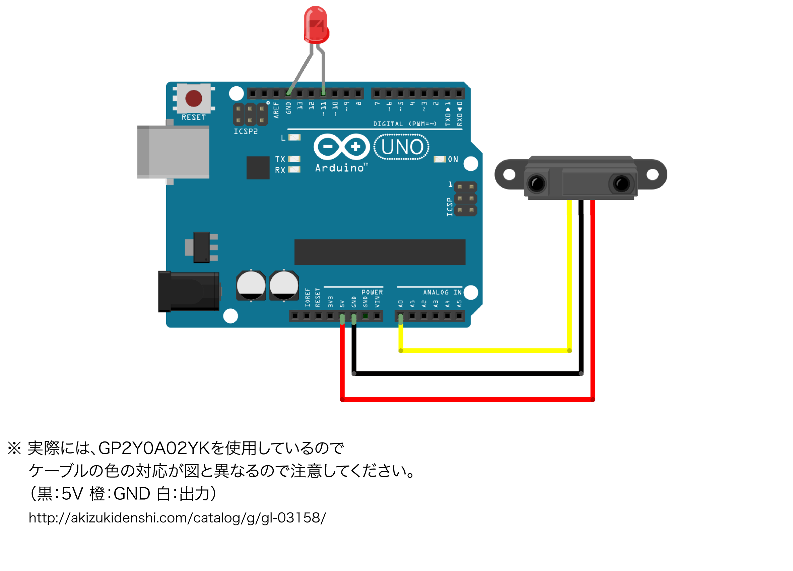

# ds_sample

distance sensor sample programs

[http://akizukidenshi.com/catalog/g/gI-03158/](http://akizukidenshi.com/catalog/g/gI-03158/ "http://akizukidenshi.com/catalog/g/gI-03158/")

## circuits

## sample programs

### ds_sample1.ino

一定以上近づくと、LEDが光る

### ds_sample2.ino

一定以上近づくと、LEDが消える

### ds_sample3.ino

近づくと段階的にLEDが光る

### ds_sample4.ino

近づくと段階的にLEDが消える

### ds_sample5.ino

一定以上近づくと、LEDが段階的に光り始める

### ds_sample6.ino

一定以上近づくと、LEDが段階的に消え始める

### ds_sample7.ino

一定以上近づくと、LEDが段階的に光り始める、その後段階的に消えていく

